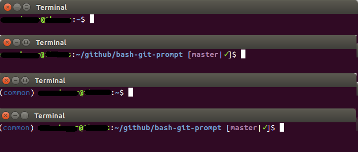

# Informative git prompt for bash and fish

This tree is a fork from [magicmonty/bash-git-prompt](https://github.com/magicmonty/bash-git-prompt)

I added my own theme to keep the prompt looking like ubuntu's default.

## Examples

The prompt may look like the following:

